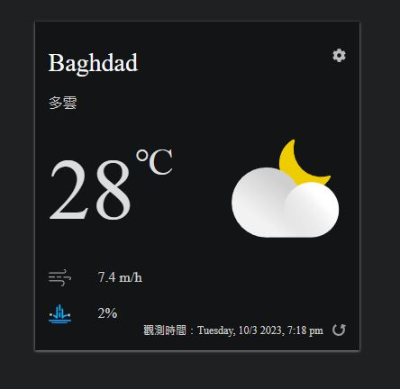
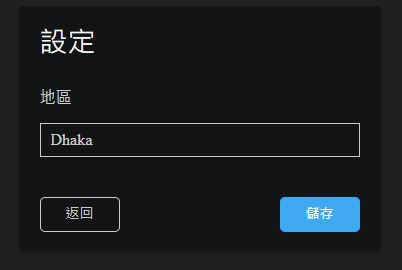

# ✨天氣

## 👋 Welcome

    這是一份基於 React 框架製作的 「天氣」 作品，學習目標如下：
    1. emotion
    2. React FontAwesome
    3. custom hook
    4. fetch串接AccuWeather天氣資料
    5. moment處理時間資料

## ✨ Features

    使用者可以觀看該地區的氣溫、風速、降雨機率及天氣描述等資訊
    使用者可以設定地區，網頁會顯示對應的天氣資訊
    theme會依照當地時間是pm或am改變

## ✨ Start the project

    1.  確認已經安裝 node.js 與 npm
    2.  clone 專案
    3.  終端機進入資料夾並輸入：`$ npm install `
    4.  安裝完畢後，繼續輸入：`$ npm start`
    5.  若要暫停使用，可在終端機執行：`ctrl + c`

## ✨ Tools

    "normalize.css": "^8.0.1",
    "@emotion/styled": "^11.11.0",
    "moment": "^2.29.4",
